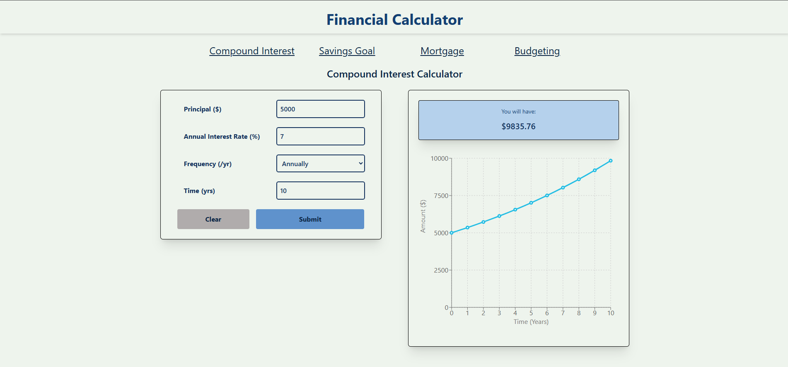

# financial-calculator

A simple financial calculator I built to learn about web development. Includes four calculators and a chart for each one. Website is also responsive and fits all screen sizes.

## Demo

[Demo Video](./media/demo.mp4)

## Frontend
- React
- Tailwind CSS
- Recharts
- Vite

## Backend
- Node.js
- Express.js

## Features
- Compound Interest Calculator
- Savings Goal Calculator
- Mortgage Calculator
- Budget Calculator
- Interactive Charts
- Responsive Design
